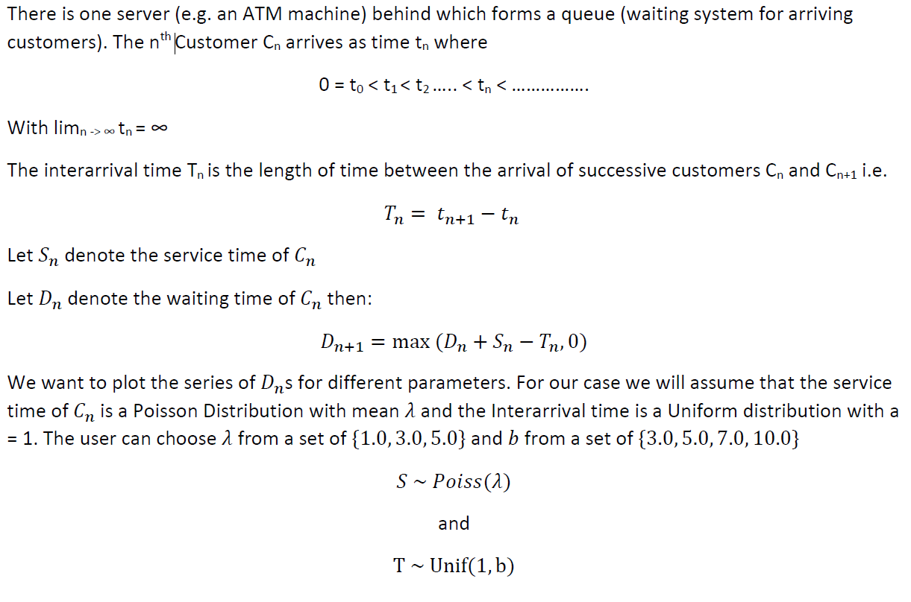
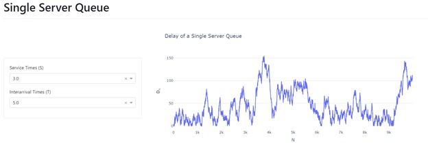

**Problem Description**

We aim to visualize the simulations of a [Single Server
Queueing](https://en.wikipedia.org/wiki/Queueing_theory#Single_queueing_nodes)
(simulation code attached) using the python library **dash**. Our goal
is to visualize the delays of each customer for a given set of
parameters.

**FIFO Single Server model**

**Expected Output**

The title of the dashboard is **Single Server Queue**

The title of the graph is **Delay of a Single Server Queue.** The color
code of the grid lines is \#dddddd with x-gridlines disabled and the
current values in the dropdown selector are disabled i.e. the user
cannot select the current values. The label of the x-axis is **N** and
y-axis is **D~n~.** The Service time (S) dropdown will be used for
selecting $\lambda$ (default: 3.0) and Interarrival Times (T) for
selecting b(default: 5.0).

